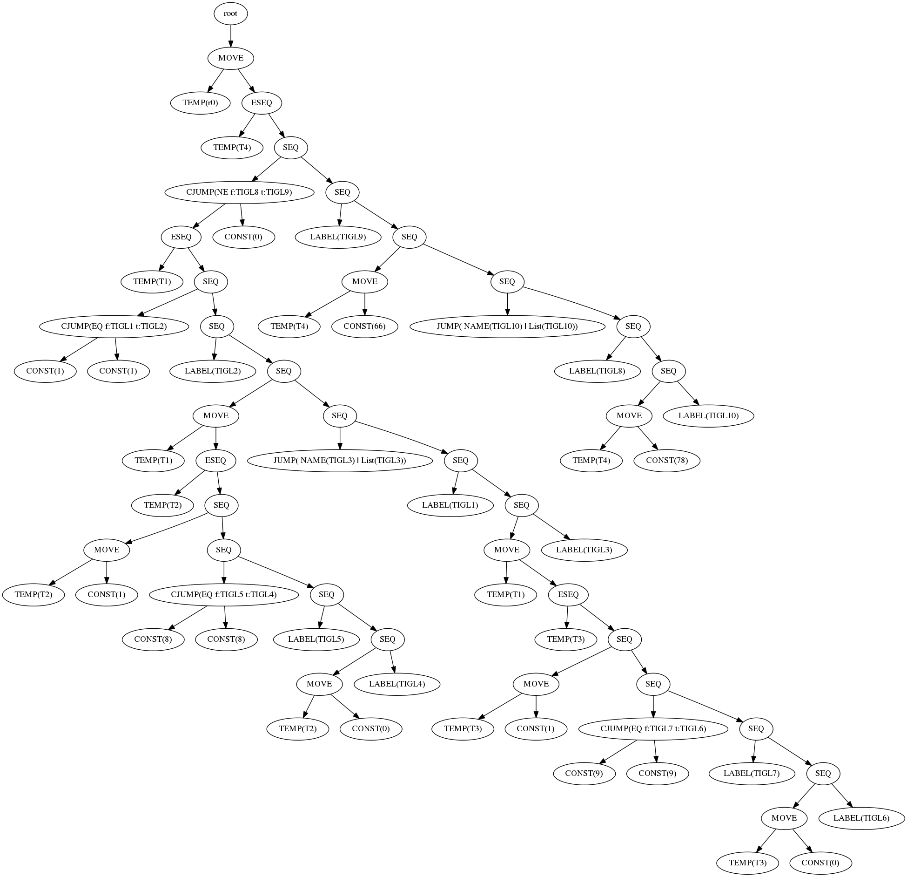

Esta función tiger:
```
function f():int = (if (if 1 = 1 then 8 = 8 else 9 = 9) then 66 else 78)
```

Me genera el siguiente código intermedio:



y el canonizador me devuelve esto:

```
CJUMP(EQ,CONST(1),CONST(1),TIGL2,TIGL1)
LABEL(TIGL2)

MOVE( d = TEMP(T2), s = CONST(1) )
CJUMP(EQ,CONST(8),CONST(8),TIGL4,TIGL5)

LABEL(TIGL5)
MOVE( d = TEMP(T2), s = CONST(0) )

LABEL(TIGL4)
MOVE( d = TEMP(T1), s = TEMP(T2) )
JUMP(NAME(TIGL3),List(TIGL3))

LABEL(TIGL1)
MOVE( d = TEMP(T3), s = CONST(1) )

CJUMP(EQ,CONST(9),CONST(9),TIGL6,TIGL7)

LABEL(TIGL7)
MOVE( d = TEMP(T3), s = CONST(0) )

LABEL(TIGL6)
MOVE( d = TEMP(T1), s = TEMP(T3) )

LABEL(TIGL3)
CJUMP(NE,TEMP(T1),CONST(0),TIGL9,TIGL8)

LABEL(TIGL9)
MOVE( d = TEMP(T4), s = CONST(66) )
JUMP(NAME(TIGL10),List(TIGL10))

LABEL(TIGL8)
MOVE( d = TEMP(T4), s = CONST(78) )

LABEL(TIGL10)
MOVE( d = TEMP(r0), s = TEMP(T4) )
```
